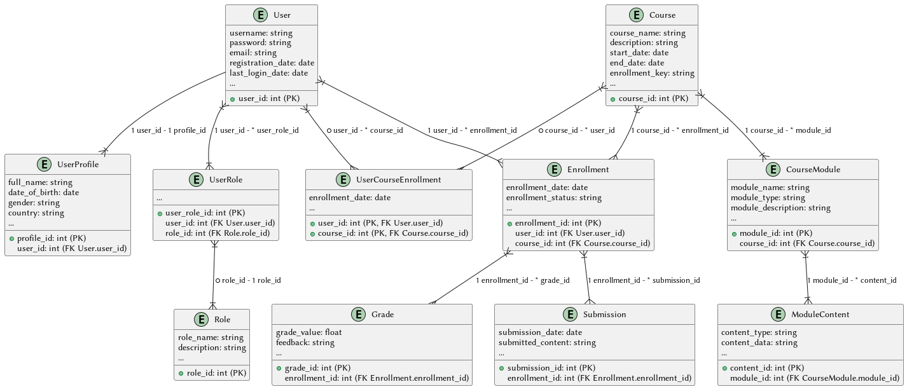

# User-Related Tables:
1. **User:** Stores basic user information such as username, password, email, registration date, and last login date.
2. **UserProfile:** Contains additional details related to users like full name, date of birth, gender, and country.
3. **UserRole:** Defines the roles associated with users, linking users to their respective roles.
4. **Role:** Describes the roles available in the system, each having a name and a description.

# Course-Related Tables:
1. **Course:** Holds details about courses offered, including course name, description, start and end dates, and enrollment key.
2. **CourseModule:** Represents modules within a course, containing information like module name, type, and a description.
3. **ModuleContent:** Stores content related to modules, allowing various types of content to be associated with a module.

# Enrollment, Grade, and Submission Tables:
1. **Enrollment:** Tracks user enrollments in courses, including enrollment date and enrollment status (e.g., enrolled, completed).
2. **Grade:** Records grades associated with enrollments, linking enrollments to grade values and any feedback provided.
3. **Submission:** Stores submissions made by users, tied to their enrollments, submission date, and submitted content.

# Relationships:

## User-Related Relationships:
- **User - UserProfile:** A one-to-one relationship between users and their profile information, allowing each user to have a unique profile.
- **User - UserRole:** A one-to-many relationship, where a user can have multiple roles in the system.
- **UserRole - Role:** A many-to-one relationship between user roles and specific roles defined in the system.

## Course-Related Relationships:
- **Course - CourseModule:** A one-to-many relationship representing multiple modules within a course.
- **CourseModule - ModuleContent:** Another one-to-many relationship linking modules to their associated content.

## Enrollment, Grade, and Submission Relationships:
- **User - Enrollment:** A one-to-many relationship, allowing users to be enrolled in multiple courses.
- **Course - Enrollment:** Another one-to-many relationship between courses and enrollments, enabling multiple enrollments in a course.
- **Enrollment - Grade:** A one-to-many relationship, associating multiple grades with an enrollment.
- **Enrollment - Submission:** A one-to-many relationship allowing multiple submissions linked to an enrollment.
