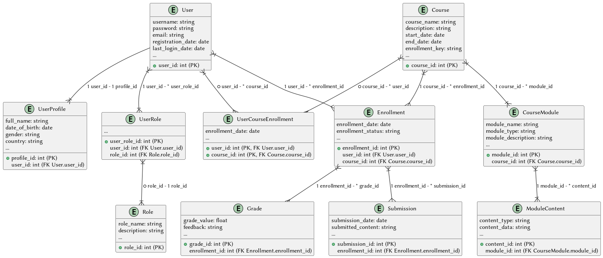

\pagebreak

# Introduction

All the data for this project is also accessible on [GitHub](https://github.com/CheesyChocolate/ScholarDB).

## schema



## User-Related Tables:
1. **User:** Stores basic user information such as username, password, email, registration date, and last login date.
2. **UserProfile:** Contains additional details related to users like full name, date of birth, gender, and country.
3. **UserRole:** Defines the roles associated with users, linking users to their respective roles.
4. **Role:** Describes the roles available in the system, each having a name and a description.

## Course-Related Tables:
1. **Course:** Holds details about courses offered, including course name, description, start and end dates, and enrollment key.
2. **CourseModule:** Represents modules within a course, containing information like module name, type, and a description.
3. **ModuleContent:** Stores content related to modules, allowing various types of content to be associated with a module.

## Enrollment, Grade, and Submission Tables:
1. **Enrollment:** Tracks user enrollments in courses, including enrollment date and enrollment status (e.g., enrolled, completed).
2. **Grade:** Records grades associated with enrollments, linking enrollments to grade values and any feedback provided.
3. **Submission:** Stores submissions made by users, tied to their enrollments, submission date, and submitted content.
4. **UserCourseEnrollment:** Represents the many-to-many relationship between users and courses for enrollment purposes, storing enrollment dates.

## Relationships:

### User-Related Relationships:
- **User - UserProfile:** A one-to-one relationship between users and their profile information, allowing each user to have a unique profile.
- **User - UserRole:** A one-to-many relationship, where a user can have multiple roles in the system.
- **UserRole - Role:** A many-to-one relationship between user roles and specific roles defined in the system.

### Course-Related Relationships:
- **Course - CourseModule:** A one-to-many relationship representing multiple modules within a course.
- **CourseModule - ModuleContent:** Another one-to-many relationship linking modules to their associated content.

### Enrollment, Grade, and Submission Relationships:
- **User - Enrollment:** A one-to-many relationship, allowing users to be enrolled in multiple courses.
- **Course - Enrollment:** Another one-to-many relationship between courses and enrollments, enabling multiple enrollments in a course.
- **Enrollment - Grade:** A one-to-many relationship, associating multiple grades with an enrollment.
- **Enrollment - Submission:** A one-to-many relationship allowing multiple submissions linked to an enrollment.
- **User - UserCourseEnrollment:** A many-to-many relationship representing enrollments of users in multiple courses and vice versa.

# Database Schema (20 Points)

## Create 5-7 entities with 1:1, 1:M, and M:N relationships.

```sql
-- Create User-related tables
CREATE TABLE User (
	user_id INT PRIMARY KEY,
	username VARCHAR(50),
	password VARCHAR(50),
	email VARCHAR(100),
	registration_date DATE,
	last_login_date DATE
);

CREATE TABLE Role (
	role_id INT PRIMARY KEY,
	role_name VARCHAR(50),
	description VARCHAR(255)
);

CREATE TABLE UserRole (
	user_role_id INT PRIMARY KEY,
	user_id INT,
	role_id INT,
	FOREIGN KEY (user_id) REFERENCES User(user_id) ON DELETE CASCADE,
	FOREIGN KEY (role_id) REFERENCES Role(role_id) ON DELETE CASCADE
);

CREATE TABLE UserProfile (
	profile_id INT PRIMARY KEY,
	user_id INT,
	full_name VARCHAR(100),
	date_of_birth DATE,
	gender VARCHAR(10),
	country VARCHAR(50),
	FOREIGN KEY (user_id) REFERENCES User(user_id) ON DELETE SET NULL
);

-- Create Course-related tables
CREATE TABLE Course (
	course_id INT PRIMARY KEY,
	course_name VARCHAR(100),
	description TEXT,
	start_date DATE,
	end_date DATE,
	enrollment_key VARCHAR(20)
);

CREATE TABLE CourseModule (
	module_id INT PRIMARY KEY,
	course_id INT,
	module_name VARCHAR(100),
	module_type VARCHAR(50),
	module_description TEXT,
	FOREIGN KEY (course_id) REFERENCES Course(course_id) ON DELETE CASCADE
);

CREATE TABLE ModuleContent (
	content_id INT PRIMARY KEY,
	module_id INT,
	content_type VARCHAR(50),
	content_data TEXT,
	FOREIGN KEY (module_id) REFERENCES CourseModule(module_id) ON DELETE CASCADE
);

-- Create Enrollment, Grade, and Submission tables
CREATE TABLE Enrollment (
	enrollment_id INT PRIMARY KEY,
	user_id INT,
	course_id INT,
	enrollment_date DATE,
	enrollment_status VARCHAR(20),
	FOREIGN KEY (user_id) REFERENCES User(user_id) ON DELETE SET NULL,
	FOREIGN KEY (course_id) REFERENCES Course(course_id) ON DELETE CASCADE
);

CREATE TABLE Grade (
	grade_id INT PRIMARY KEY,
	enrollment_id INT,
	grade_value FLOAT,
	feedback TEXT,
	FOREIGN KEY (enrollment_id) REFERENCES Enrollment(enrollment_id) ON DELETE CASCADE
);

CREATE TABLE Submission (
	submission_id INT PRIMARY KEY,
	enrollment_id INT,
	submission_date DATE,
	submitted_content TEXT,
	FOREIGN KEY (enrollment_id) REFERENCES Enrollment(enrollment_id) ON DELETE CASCADE
);

-- Create UserCourseEnrollment table
CREATE TABLE UserCourseEnrollment (
	user_id INT,
	course_id INT,
	enrollment_date DATE,
	PRIMARY KEY (user_id, course_id),
	FOREIGN KEY (user_id) REFERENCES User(user_id) ON DELETE CASCADE,
	FOREIGN KEY (course_id) REFERENCES Course(course_id) ON DELETE CASCADE
);
```

---

## Define primary keys for each table.

* done

---

## Implement foreign keys using ON DELETE SET NULL and ON DELETE CASCADE.

* done

---

## Populate each table with at least 20 tuples.

```sql
-- Sample data for the User table
INSERT INTO User VALUES (1, 'john_doe', 'password123', 'john@example.com', '2023-01-01', '2023-01-10');
INSERT INTO User VALUES (2, 'jane_smith', 'hello456', 'jane@example.com', '2023-02-15', '2023-02-20');
INSERT INTO User VALUES (3, 'alex_smith', 'pass789', 'alex@example.com', '2023-03-20', '2023-04-05');
INSERT INTO User VALUES (4, 'sarah_jones', 'sarahpass', 'sarah@example.com', '2023-04-10', '2023-04-20');
INSERT INTO User VALUES (5, 'emma_watson', 'emmaw123', 'emma@example.com', '2023-05-10', '2023-05-20');
INSERT INTO User VALUES (6, 'david_smith', 'davidpass', 'david@example.com', '2023-06-15', '2023-06-25');
INSERT INTO User VALUES (7, 'lisa_jackson', 'lisa123', 'lisa@example.com', '2023-07-10', '2023-07-20');
INSERT INTO User VALUES (8, 'michael_brown', 'michaelpass', 'michael@example.com', '2023-08-15', '2023-08-25');
INSERT INTO User VALUES (9, 'kevin_adams', 'kevinpass', 'kevin@example.com', '2023-09-20', '2023-09-30');
INSERT INTO User VALUES (10, 'sophia_wilson', 'sophiapass', 'sophia@example.com', '2023-10-25', '2023-11-05');
INSERT INTO User VALUES (11, 'olivia_johnson', 'olivia123', 'olivia@example.com', '2024-03-01', '2024-03-15');
INSERT INTO User VALUES (12, 'ethan_miller', 'ethanpass', 'ethan@example.com', '2024-04-05', '2024-04-20');
INSERT INTO User VALUES (13, 'grace_carter', 'gracepass', 'grace@example.com', '2024-09-01', '2024-09-15');
INSERT INTO User VALUES (14, 'noah_thompson', 'noahpass', 'noah@example.com', '2024-10-05', '2024-10-20');
INSERT INTO User VALUES (15, 'oliver_wilson', 'oliverpass', 'oliver@example.com', '2025-03-01', '2025-03-15');
INSERT INTO User VALUES (16, 'ava_roberts', 'avapass', 'ava@example.com', '2025-04-05', '2025-04-20');
INSERT INTO User VALUES (17, 'emma_cook', 'emmapass', 'emma@example.com', '2026-09-01', '2026-09-15');
INSERT INTO User VALUES (18, 'liam_harris', 'liampass', 'liam@example.com', '2026-10-05', '2026-10-20');
INSERT INTO User VALUES (19, 'harper_turner', 'harperpass', 'harper@example.com', '2027-03-01', '2027-03-15');
INSERT INTO User VALUES (20, 'mason_adams', 'masonpass', 'mason@example.com', '2027-04-05', '2027-04-20');

-- Sample data for the UserProfile table
INSERT INTO UserProfile VALUES (1, 1, 'John Doe', '1990-05-15', 'Male', 'USA');
INSERT INTO UserProfile VALUES (2, 2, 'Jane Smith', '1988-09-22', 'Female', 'Canada');
INSERT INTO UserProfile VALUES (3, 3, 'Alex Smith', '1985-08-12', 'Male', 'UK');
INSERT INTO UserProfile VALUES (4, 4, 'Sarah Jones', '1992-01-25', 'Female', 'Australia');
INSERT INTO UserProfile VALUES (5, 5, 'Emma Watson', '1989-04-15', 'Female', 'UK');
INSERT INTO UserProfile VALUES (6, 6, 'David Smith', '1995-11-22', 'Male', 'USA');
INSERT INTO UserProfile VALUES (7, 7, 'Lisa Jackson', '1992-09-05', 'Female', 'USA');
INSERT INTO UserProfile VALUES (8, 8, 'Michael Brown', '1985-12-12', 'Male', 'Canada');
INSERT INTO UserProfile VALUES (9, 9, 'Kevin Adams', '1988-06-18', 'Male', 'Australia');
INSERT INTO UserProfile VALUES (10, 10, 'Sophia Wilson', '1993-03-29', 'Female', 'USA');
INSERT INTO UserProfile VALUES (11, 11, 'Olivia Johnson', '1990-12-28', 'Female', 'Canada');
INSERT INTO UserProfile VALUES (12, 12, 'Ethan Miller', '1987-09-18', 'Male', 'USA');
INSERT INTO UserProfile VALUES (13, 13, 'Grace Carter', '1993-06-20', 'Female', 'Australia');
INSERT INTO UserProfile VALUES (14, 14, 'Noah Thompson', '1990-11-10', 'Male', 'USA');
INSERT INTO UserProfile VALUES (15, 15, 'Oliver Wilson', '1995-09-12', 'Male', 'UK');
INSERT INTO UserProfile VALUES (16, 16, 'Ava Roberts', '1992-07-25', 'Female', 'Canada');
INSERT INTO UserProfile VALUES (17, 17, 'Emma Cook', '1996-07-18', 'Female', 'USA');
INSERT INTO UserProfile VALUES (18, 18, 'Liam Harris', '1993-02-12', 'Male', 'Canada');
INSERT INTO UserProfile VALUES (19, 19, 'Harper Turner', '1991-08-24', 'Female', 'Canada');
INSERT INTO UserProfile VALUES (20, 20, 'Mason Adams', '1990-05-12', 'Male', 'USA');

-- Sample data for the Role table
INSERT INTO Role VALUES (1, 'Student', 'Role for students');
INSERT INTO Role VALUES (2, 'Teacher', 'Role for teachers');
INSERT INTO Role VALUES (3, 'Admin', 'Role for administrators');
INSERT INTO Role VALUES (4, 'Staff', 'Role for staff');
INSERT INTO Role VALUES (5, 'Guest', 'Role for guests');
INSERT INTO Role VALUES (6, 'Support', 'Role for support');
INSERT INTO Role VALUES (7, 'Alumni', 'Role for alumni');
INSERT INTO Role VALUES (8, 'Researcher', 'Role for researchers');
INSERT INTO Role VALUES (9, 'Librarian', 'Role for librarians');
INSERT INTO Role VALUES (10, 'Manager', 'Role for managers');
INSERT INTO Role VALUES (11, 'Editor', 'Role for editors');
INSERT INTO Role VALUES (12, 'Developer', 'Role for developers');
INSERT INTO Role VALUES (13, 'Designer', 'Role for designers');
INSERT INTO Role VALUES (14, 'Analyst', 'Role for analysts');
INSERT INTO Role VALUES (15, 'Writer', 'Role for writers');
INSERT INTO Role VALUES (16, 'Consultant', 'Role for consultants');
INSERT INTO Role VALUES (17, 'Sales', 'Role for sales');
INSERT INTO Role VALUES (18, 'Marketing', 'Role for marketing');
INSERT INTO Role VALUES (19, 'Intern', 'Role for interns');
INSERT INTO Role VALUES (20, 'Advisor', 'Role for advisors');

-- Sample data for the UserRole table
INSERT INTO UserRole VALUES (1, 1, 1);
INSERT INTO UserRole VALUES (2, 2, 2);
INSERT INTO UserRole VALUES (3, 3, 1);
INSERT INTO UserRole VALUES (4, 4, 1);
INSERT INTO UserRole VALUES (5, 5, 1);
INSERT INTO UserRole VALUES (6, 6, 2);
INSERT INTO UserRole VALUES (7, 7, 1);
INSERT INTO UserRole VALUES (8, 8, 2);
INSERT INTO UserRole VALUES (9, 9, 1);
INSERT INTO UserRole VALUES (10, 10, 2);
INSERT INTO UserRole VALUES (11, 11, 1);
INSERT INTO UserRole VALUES (12, 12, 2);
INSERT INTO UserRole VALUES (13, 13, 1);
INSERT INTO UserRole VALUES (14, 14, 2);
INSERT INTO UserRole VALUES (15, 15, 1);
INSERT INTO UserRole VALUES (16, 16, 2);
INSERT INTO UserRole VALUES (17, 17, 1);
INSERT INTO UserRole VALUES (18, 18, 2);
INSERT INTO UserRole VALUES (19, 19, 1);
INSERT INTO UserRole VALUES (20, 20, 2);

-- Sample data for the Course table
INSERT INTO Course VALUES (1, 'Introduction to Programming', 'Basic programming concepts', '2023-03-01', '2023-04-30', 'abc123');
INSERT INTO Course VALUES (2, 'Database Management', 'SQL and database concepts', '2023-05-01', '2023-06-30', 'xyz789');
INSERT INTO Course VALUES (3, 'Machine Learning Basics', 'Introduction to ML concepts', '2023-07-01', '2023-08-30', 'ml123');
INSERT INTO Course VALUES (4, 'Web Development Fundamentals', 'Basics of web development', '2023-09-01', '2023-10-31', 'web456');
INSERT INTO Course VALUES (5, 'Data Structures', 'Introduction to data structures', '2023-07-01', '2023-08-31', 'ds789');
INSERT INTO Course VALUES (6, 'Software Engineering', 'Principles of software engineering', '2023-09-01', '2023-10-30', 'se567');
INSERT INTO Course VALUES (7, 'Algorithms', 'Introduction to algorithms', '2023-09-01', '2023-10-31', 'algo456');
INSERT INTO Course VALUES (8, 'Computer Networks', 'Basics of computer networks', '2023-11-01', '2023-12-31', 'net789');
INSERT INTO Course VALUES (9, 'Operating Systems', 'Principles of operating systems', '2023-11-10', '2023-12-31', 'os123');
INSERT INTO Course VALUES (10, 'Data Mining', 'Introduction to data mining', '2024-01-01', '2024-02-28', 'data456');
INSERT INTO Course VALUES (11, 'Computer Architecture', 'Basics of computer architecture', '2024-05-01', '2024-06-30', 'arch123');
INSERT INTO Course VALUES (12, 'Artificial Intelligence', 'Introduction to AI concepts', '2024-07-01', '2024-08-31', 'ai456');
INSERT INTO Course VALUES (13, 'Computer Graphics', 'Introduction to computer graphics', '2024-11-01', '2024-12-31', 'graphics123');
INSERT INTO Course VALUES (14, 'Software Testing', 'Fundamentals of software testing', '2025-01-01', '2025-02-28', 'testing456');
INSERT INTO Course VALUES (15, 'Web Development', 'Introduction to web development', '2025-05-01', '2025-06-30', 'webdev123');
INSERT INTO Course VALUES (16, 'Mobile App Development', 'Fundamentals of mobile app development', '2025-07-01', '2025-08-31', 'mobile123');
INSERT INTO Course VALUES (17, 'Cybersecurity', 'Fundamentals of cybersecurity', '2026-11-01', '2026-12-31', 'cyber123');
INSERT INTO Course VALUES (18, 'Data Science', 'Introduction to data science', '2027-01-01', '2027-02-28', 'datascience456');
INSERT INTO Course VALUES (19, 'Machine Learning', 'Fundamentals of machine learning', '2027-05-01', '2027-06-30', 'ml123');
INSERT INTO Course VALUES (20, 'Software Engineering', 'Introduction to software engineering', '2027-07-01', '2027-08-31', 'software123');

-- Sample data for the CourseModule table
INSERT INTO CourseModule VALUES (1, 1, 'Variables and Data Types', 'Lesson', 'Introduction to variables and data types');
INSERT INTO CourseModule VALUES (2, 1, 'Conditional Statements', 'Lesson', 'Understanding if-else statements');
INSERT INTO CourseModule VALUES (3, 3, 'Introduction to ML Algorithms', 'Lesson', 'Overview of machine learning algorithms');
INSERT INTO CourseModule VALUES (4, 4, 'HTML Basics', 'Lesson', 'Introduction to HTML');
INSERT INTO CourseModule VALUES (5, 5, 'Arrays and Linked Lists', 'Lesson', 'Basics of arrays and linked lists');
INSERT INTO CourseModule VALUES (6, 5, 'Stacks and Queues', 'Lesson', 'Understanding stacks and queues');
INSERT INTO CourseModule VALUES (7, 7, 'Sorting Algorithms', 'Lesson', 'Understanding sorting algorithms');
INSERT INTO CourseModule VALUES (8, 7, 'Search Algorithms', 'Lesson', 'Exploring search algorithms');
INSERT INTO CourseModule VALUES (9, 9, 'Memory Management', 'Lesson', 'Understanding memory management in OS');
INSERT INTO CourseModule VALUES (10, 9, 'Process Scheduling', 'Lesson', 'Exploring process scheduling algorithms');
INSERT INTO CourseModule VALUES (11, 11, 'CPU Design', 'Lesson', 'Understanding CPU design principles');
INSERT INTO CourseModule VALUES (12, 11, 'Memory Systems', 'Lesson', 'Exploring computer memory systems');
INSERT INTO CourseModule VALUES (13, 13, 'Rendering Techniques', 'Lesson', 'Understanding rendering techniques');
INSERT INTO CourseModule VALUES (14, 13, '3D Modeling', 'Lesson', 'Exploring 3D modeling concepts');
INSERT INTO CourseModule VALUES (15, 15, 'HTML & CSS', 'Lesson', 'Introduction to HTML and CSS');
INSERT INTO CourseModule VALUES (16, 15, 'JavaScript', 'Lesson', 'Fundamentals of JavaScript');
INSERT INTO CourseModule VALUES (17, 17, 'Network Security', 'Lesson', 'Understanding network security');
INSERT INTO CourseModule VALUES (18, 17, 'Cyber Threats', 'Lesson', 'Exploring cyber threats');
INSERT INTO CourseModule VALUES (19, 19, 'Supervised Learning', 'Lesson', 'Understanding supervised learning');
INSERT INTO CourseModule VALUES (20, 19, 'Unsupervised Learning', 'Lesson', 'Exploring unsupervised learning');

-- Sample data for the ModuleContent table
INSERT INTO ModuleContent VALUES (1, 1, 'Text', 'This module covers the basics of variables and data types.');
INSERT INTO ModuleContent VALUES (2, 2, 'Text', 'This module covers conditional statements.');
INSERT INTO ModuleContent VALUES (3, 3, 'Text', 'This module covers different ML algorithms.');
INSERT INTO ModuleContent VALUES (4, 4, 'Text', 'This module covers basic HTML tags.');
INSERT INTO ModuleContent VALUES (5, 5, 'Text', 'This module covers the basics of data structures.');
INSERT INTO ModuleContent VALUES (6, 6, 'Text', 'This module focuses on software engineering principles.');
INSERT INTO ModuleContent VALUES (7, 7, 'Text', 'This module covers different sorting algorithms.');
INSERT INTO ModuleContent VALUES (8, 8, 'Text', 'This module focuses on computer network fundamentals.');
INSERT INTO ModuleContent VALUES (9, 9, 'Text', 'This module covers memory management concepts.');
INSERT INTO ModuleContent VALUES (10, 10, 'Text', 'This module focuses on data mining techniques.');
INSERT INTO ModuleContent VALUES (11, 11, 'Text', 'This module covers CPU design concepts.');
INSERT INTO ModuleContent VALUES (12, 12, 'Text', 'This module focuses on memory system architectures.');
INSERT INTO ModuleContent VALUES (13, 13, 'Text', 'This module covers various rendering techniques.');
INSERT INTO ModuleContent VALUES (14, 14, 'Text', 'This module focuses on principles of 3D modeling.');
INSERT INTO ModuleContent VALUES (15, 15, 'Text', 'This module covers basics of HTML and CSS.');
INSERT INTO ModuleContent VALUES (16, 16, 'Text', 'This module focuses on core concepts of JavaScript.');
INSERT INTO ModuleContent VALUES (17, 17, 'Text', 'This module covers various network security techniques.');
INSERT INTO ModuleContent VALUES (18, 18, 'Text', 'This module focuses on different types of cyber threats.');
INSERT INTO ModuleContent VALUES (19, 19, 'Text', 'This module covers supervised learning techniques.');
INSERT INTO ModuleContent VALUES (20, 20, 'Text', 'This module focuses on unsupervised learning concepts.');

-- Sample data for the Enrollment table
INSERT INTO Enrollment VALUES (1, 1, 1, '2023-03-05', 'Enrolled');
INSERT INTO Enrollment VALUES (2, 2, 2, '2023-03-10', 'Enrolled');
INSERT INTO Enrollment VALUES (3, 3, 3, '2023-07-05', 'Enrolled');
INSERT INTO Enrollment VALUES (4, 4, 4, '2023-09-10', 'Enrolled');
INSERT INTO Enrollment VALUES (5, 5, 5, '2023-07-05', 'Enrolled');
INSERT INTO Enrollment VALUES (6, 6, 6, '2023-09-10', 'Enrolled');
INSERT INTO Enrollment VALUES (7, 7, 7, '2023-09-10', 'Enrolled');
INSERT INTO Enrollment VALUES (8, 8, 8, '2023-11-15', 'Enrolled');
INSERT INTO Enrollment VALUES (9, 9, 9, '2023-11-15', 'Enrolled');
INSERT INTO Enrollment VALUES (10, 10, 10, '2024-01-05', 'Enrolled');
INSERT INTO Enrollment VALUES (11, 11, 11, '2024-05-05', 'Enrolled');
INSERT INTO Enrollment VALUES (12, 12, 12, '2024-07-10', 'Enrolled');
INSERT INTO Enrollment VALUES (13, 13, 13, '2024-11-05', 'Enrolled');
INSERT INTO Enrollment VALUES (14, 14, 14, '2025-01-10', 'Enrolled');
INSERT INTO Enrollment VALUES (15, 15, 15, '2025-05-05', 'Enrolled');
INSERT INTO Enrollment VALUES (16, 16, 16, '2025-07-10', 'Enrolled');
INSERT INTO Enrollment VALUES (17, 17, 17, '2026-11-05', 'Enrolled');
INSERT INTO Enrollment VALUES (18, 18, 18, '2027-01-10', 'Enrolled');
INSERT INTO Enrollment VALUES (19, 19, 19, '2027-05-05', 'Enrolled');
INSERT INTO Enrollment VALUES (20, 20, 20, '2027-07-10', 'Enrolled');

-- Sample data for the Grade table
INSERT INTO Grade VALUES (1, 1, 90, 'Good work!');
INSERT INTO Grade VALUES (2, 2, 85, 'Well done.');
INSERT INTO Grade VALUES (3, 3, 88, 'Nice work!');
INSERT INTO Grade VALUES (4, 4, 92, 'Great job!');
INSERT INTO Grade VALUES (5, 5, 85, 'Good work!');
INSERT INTO Grade VALUES (6, 6, 90, 'Well done!');
INSERT INTO Grade VALUES (7, 7, 88, 'Great work!');
INSERT INTO Grade VALUES (8, 8, 92, 'Excellent job!');
INSERT INTO Grade VALUES (9, 9, 85, 'Well done!');
INSERT INTO Grade VALUES (10, 10, 90, 'Excellent work!');
INSERT INTO Grade VALUES (11, 11, 87, 'Great job!');
INSERT INTO Grade VALUES (12, 12, 93, 'Excellent work!');
INSERT INTO Grade VALUES (13, 13, 88, 'Well done!');
INSERT INTO Grade VALUES (14, 14, 95, 'Excellent work!');
INSERT INTO Grade VALUES (15, 15, 86, 'Great job!');
INSERT INTO Grade VALUES (16, 16, 93, 'Excellent work!');
INSERT INTO Grade VALUES (17, 17, 85, 'Well done!');
INSERT INTO Grade VALUES (18, 18, 92, 'Excellent work!');
INSERT INTO Grade VALUES (19, 19, 88, 'Great job!');
INSERT INTO Grade VALUES (20, 20, 94, 'Excellent work!');

-- Sample data for the Submission table
INSERT INTO Submission VALUES (1, 1, '2023-04-15', 'Submitted code for the assignment.');
INSERT INTO Submission VALUES (2, 2, '2023-05-20', 'Submitted database design project.');
INSERT INTO Submission VALUES (3, 3, '2023-08-15', 'Submitted ML project.');
INSERT INTO Submission VALUES (4, 4, '2023-10-20', 'Submitted web development assignment.');
INSERT INTO Submission VALUES (5, 5, '2023-08-15', 'Submitted data structures assignment.');
INSERT INTO Submission VALUES (6, 6, '2023-10-20', 'Submitted software engineering project.');
INSERT INTO Submission VALUES (7, 7, '2023-10-20', 'Submitted algorithms assignment.');
INSERT INTO Submission VALUES (8, 8, '2024-01-05', 'Submitted computer networks project.');
INSERT INTO Submission VALUES (9, 9, '2023-12-05', 'Submitted OS assignment.');
INSERT INTO Submission VALUES (10, 10, '2024-02-10', 'Submitted data mining project.');
INSERT INTO Submission VALUES (11, 11, '2024-06-15', 'Submitted computer architecture assignment.');
INSERT INTO Submission VALUES (12, 12, '2024-08-20', 'Submitted AI project.');
INSERT INTO Submission VALUES (13, 13, '2024-12-15', 'Submitted computer graphics assignment.');
INSERT INTO Submission VALUES (14, 14, '2025-02-20', 'Submitted software testing project.');
INSERT INTO Submission VALUES (15, 15, '2025-06-15', 'Submitted web development assignment.');
INSERT INTO Submission VALUES (16, 16, '2025-08-20', 'Submitted mobile app development project.');
INSERT INTO Submission VALUES (17, 17, '2026-12-15', 'Submitted cybersecurity assignment.');
INSERT INTO Submission VALUES (18, 18, '2027-02-20', 'Submitted data science project.');
INSERT INTO Submission VALUES (19, 19, '2027-06-15', 'Submitted machine learning assignment.');
INSERT INTO Submission VALUES (20, 20, '2027-08-20', 'Submitted software engineering project.');

-- Sample data for the UserCourseEnrollment table
INSERT INTO UserCourseEnrollment VALUES (1, 1, '2023-03-05');
INSERT INTO UserCourseEnrollment VALUES (2, 2, '2023-03-10');
INSERT INTO UserCourseEnrollment VALUES (3, 3, '2023-07-05');
INSERT INTO UserCourseEnrollment VALUES (4, 4, '2023-09-10');
INSERT INTO UserCourseEnrollment VALUES (5, 5, '2023-07-05');
INSERT INTO UserCourseEnrollment VALUES (6, 6, '2023-09-10');
INSERT INTO UserCourseEnrollment VALUES (7, 7, '2023-09-10');
INSERT INTO UserCourseEnrollment VALUES (8, 8, '2023-11-15');
INSERT INTO UserCourseEnrollment VALUES (9, 9, '2023-11-15');
INSERT INTO UserCourseEnrollment VALUES (10, 10, '2024-01-05');
INSERT INTO UserCourseEnrollment VALUES (11, 11, '2024-05-05');
INSERT INTO UserCourseEnrollment VALUES (12, 12, '2024-07-10');
INSERT INTO UserCourseEnrollment VALUES (13, 13, '2024-11-05');
INSERT INTO UserCourseEnrollment VALUES (14, 14, '2025-01-10');
INSERT INTO UserCourseEnrollment VALUES (15, 15, '2025-05-05');
INSERT INTO UserCourseEnrollment VALUES (16, 16, '2025-07-10');
INSERT INTO UserCourseEnrollment VALUES (17, 17, '2026-11-05');
INSERT INTO UserCourseEnrollment VALUES (18, 18, '2027-01-10');
INSERT INTO UserCourseEnrollment VALUES (19, 19, '2027-05-05');
INSERT INTO UserCourseEnrollment VALUES (20, 20, '2027-07-10');
```

---

\pagebreak

# Simple Queries (35 Points)

## query all the tuples in all tables. (extra)

```sql
-- Query to retrieve data from all tables
SELECT * FROM User;
SELECT * FROM Role;
SELECT * FROM UserRole;
SELECT * FROM UserProfile;
SELECT * FROM Course;
SELECT * FROM CourseModule;
SELECT * FROM ModuleContent;
SELECT * FROM Enrollment;
SELECT * FROM Grade;
SELECT * FROM Submission;
SELECT * FROM UserCourseEnrollment;
```

## Insert 3 tuples into different tables.

```sql
```
-- Inserting a tuple into the User table
INSERT INTO User VALUES (21, 'alice_smith', 'pass789', 'alice@example.com', '2023-03-01', '2023-03-10');

-- Inserting a tuple into the Course table
INSERT INTO Course VALUES (21, 'Web Development', 'Introduction to web development', '2023-06-01', '2023-07-31', 'web123');

-- Inserting a tuple into the Grade table
INSERT INTO Grade VALUES (21, 1, 88, 'Great job on the assignment!');
---

## Insert 5 tuples into the same table.

```sql
-- Inserting 5 tuples into the User table
INSERT INTO User VALUES
    (22, 'user1', 'pass1', 'user1@example.com', '2023-04-01', '2023-04-10'),
    (23, 'user2', 'pass2', 'user2@example.com', '2023-04-02', '2023-04-11'),
    (24, 'user3', 'pass3', 'user3@example.com', '2023-04-03', '2023-04-12'),
    (25, 'user4', 'pass4', 'user4@example.com', '2023-04-04', '2023-04-13'),
    (26, 'user5', 'pass5', 'user5@example.com', '2023-04-05', '2023-04-14');
```

---

## Update 3 tuples in different tables.

```sql
-- Update a tuple in the User table
UPDATE User
SET password = 'new_pass'
WHERE user_id = 4;

-- Update a tuple in the Course table
UPDATE Course
SET description = 'Updated description'
WHERE course_id = 1;

-- Update a tuple in the Grade table
UPDATE Grade
SET grade_value = 95
WHERE grade_id = 1;
```

---

## Delete 3 tuples in different tables.

```sql
-- Delete a tuple from the User table
DELETE FROM User
WHERE user_id = 4;

-- Delete a tuple from the Course table
DELETE FROM Course
WHERE course_id = 1;

-- Delete a tuple from the Grade table
DELETE FROM Grade
WHERE grade_id = 1;
```

---

## Add CHECK constraint.

```sql
-- does not work in SQLite
-- But works in MySQL. Yaaaaaay!
-- Add a CHECK constraint to the Grade table
ALTER TABLE Grade
ADD CONSTRAINT check_grade_value
CHECK (grade_value >= 0 AND grade_value <= 100);
```

---

## Create 3 queries using WHERE clause and comparison operators.

```sql
-- Query 1: Select users with registration dates after a specific date
SELECT *
FROM User
WHERE registration_date > '2023-03-01';

-- Query 2: Select courses with end dates before a specific date
SELECT *
FROM Course
WHERE end_date < '2023-05-01';

-- Query 3: Select submissions with submission dates between two specific dates
SELECT *
FROM Submission
WHERE submission_date BETWEEN '2023-04-01' AND '2023-04-30';
```

---

## Create 3 queries using WHERE clause and arithmetic operators.

```sql
-- Query 1: Select users with registration dates within the last 90 days
SELECT *
FROM User
WHERE DATEDIFF(CURRENT_DATE(), registration_date) <= 90;

-- Query 2: Select courses with module counts greater than or equal to 5
SELECT c.course_id, c.course_name, COUNT(cm.module_id) AS total_modules
FROM Course c
LEFT JOIN CourseModule cm ON c.course_id = cm.course_id
GROUP BY c.course_id, c.course_name
HAVING total_modules >= 5;

-- Query 3: Select enrollments with grades greater than the course's passing grade
SELECT e.enrollment_id, e.user_id, e.course_id, g.grade_value
FROM Enrollment e
LEFT JOIN Grade g ON e.enrollment_id = g.enrollment_id
JOIN Course c ON e.course_id = c.course_id
WHERE g.grade_value > (50 + 10); -- Select enrollments with grades greater than passing grade(50) + 10
```

---

## Create 3 queries using WHERE clause and logical operators.

```sql
-- Query 0: Select users who are either teachers or have a grade greater than 90
SELECT *
FROM User
JOIN UserRole ON User.user_id = UserRole.user_id
JOIN Role ON UserRole.role_id = Role.role_id
LEFT JOIN Grade ON User.user_id = Grade.enrollment_id  -- Assuming Grade has an enrollment_id column
WHERE Role.role_name = 'Teacher' OR (Grade.grade_value > 90 AND Grade.grade_value IS NOT NULL);

-- Query 1: Users who registered after 2023-01-01 and last logged in before 2023-06-01
SELECT *
FROM User
WHERE registration_date > '2023-01-01' AND last_login_date < '2023-06-01';

-- Query 2: Courses that start between 2023-01-01 and 2023-06-01 and end between 2023-12-01 and 2024-06-01
SELECT *
FROM Course
WHERE start_date BETWEEN '1998-01-01' AND '2023-06-01'
AND end_date BETWEEN '2000-12-01' AND '2024-06-01';

-- Query 3: UserProfiles for users from 'USA' and are 'Female'
SELECT *
FROM UserProfile
WHERE country = 'USA' AND gender = 'Female';
```

---

## Create 3 queries using special operators (BETWEEN, IS NULL, LIKE, IN, EXISTS).

```sql
-- Query 1: Select users who registered between two specific dates using BETWEEN
SELECT *
FROM User
WHERE registration_date BETWEEN '2023-01-01' AND '2023-02-01';

-- Query 2: Select courses with no enrollments using IS NULL
SELECT *
FROM Course
WHERE course_id NOT IN (SELECT DISTINCT course_id FROM Enrollment);

-- Query 3: Select submissions with comments containing 'good' or 'excellent' using LIKE
SELECT *
FROM Submission
WHERE submitted_content LIKE '%good%' OR submitted_content LIKE '%excellent%';
```

---

## Create 3 queries using ORDER BY clause.

```sql
-- Query 1: Select users ordered by registration date in ascending order
SELECT *
FROM User
ORDER BY registration_date ASC;

-- Query 2: Select courses ordered by end date in descending order
SELECT *
FROM Course
ORDER BY end_date DESC;

-- Query 3: Select enrollments ordered by enrollment date and user ID in ascending order
SELECT *
FROM Enrollment
ORDER BY enrollment_date ASC, user_id ASC;
```

---

## Create 3 queries using DISTINCT clause.

```sql
-- Query 1: Select distinct roles from the UserRole table
SELECT DISTINCT role_id
FROM UserRole;

-- Query 2: Select distinct countries from the UserProfile table
SELECT DISTINCT country
FROM UserProfile;

-- Query 3: Select distinct course names from the Course table
SELECT DISTINCT course_name
FROM Course;
```

---

## Create 3 queries using String Functions.

```sql
-- Query 1: Select usernames and their lengths from the User table
SELECT username, LENGTH(username) AS username_length
FROM User;

-- Query 2: Select courses with names in uppercase from the Course table
SELECT course_name, UPPER(course_name) AS uppercase_course_name
FROM Course;

-- Query 3: Select users with emails ending in '.com' from the User table
SELECT *
FROM User
WHERE LOWER(email) LIKE '%.com';
```

---

## Create 3 queries using Numeric Functions.

```sql
-- Query 1: Select the average grade value for each enrollment from the Grade table
SELECT enrollment_id, AVG(grade_value) AS average_grade
FROM Grade
GROUP BY enrollment_id;

-- Query 2: Select courses with the total number of enrolled users from the Enrollment table
SELECT course_id, COUNT(DISTINCT user_id) AS total_enrolled_users
FROM Enrollment
GROUP BY course_id;

-- Query 3: This will find the earliest (oldest) date_of_birth among all users in the UserProfile table.
SELECT MAX(date_of_birth) AS oldest_birth_date
FROM UserProfile;
```

---

## Create 3 queries using Date Functions.

```sql
-- Query 1: Select users who registered in the last 30 days
SELECT *
FROM User
-- WHERE registration_date >= DATE('now', '-30 days'); -- For SQLite
WHERE registration_date >= CURDATE() - INTERVAL 30 DAY; -- For MySQL

-- Query 2: Select courses that have started today
SELECT *
FROM Course
WHERE start_date = DATE('now');

-- Query 3: Select enrollments with a duration longer than 60 days from the enrollment date
SELECT enrollment_id, (julianday('now') - julianday(enrollment_date)) AS enrollment_duration_days
FROM Enrollment
WHERE (julianday('now') - julianday(enrollment_date)) > 60;
```

---

## Create 3 queries using aggregate functions (COUNT, MIN, MAX, SUM, AVG).

```sql
-- Query 1: Count the total number of enrollments for each course
SELECT course_id, COUNT(*) AS total_enrollments
FROM Enrollment
GROUP BY course_id;

-- Query 2: Find the course with the highest average grade value
SELECT course_id, course_name, MAX(average_grade) AS highest_average_grade
FROM (
    SELECT c.course_id, c.course_name, AVG(g.grade_value) AS average_grade
    FROM Course c
    LEFT JOIN CourseModule cm ON c.course_id = cm.course_id
    LEFT JOIN ModuleContent mc ON cm.module_id = mc.module_id
    LEFT JOIN Enrollment e ON c.course_id = e.course_id
    LEFT JOIN Grade g ON e.enrollment_id = g.enrollment_id
    GROUP BY c.course_id
)
GROUP BY course_id, course_name
ORDER BY highest_average_grade DESC
LIMIT 1;

-- Query 3: Calculate the total number of submissions and the average length of submitted content
SELECT
    COUNT(*) AS total_submissions,
    AVG(LENGTH(submitted_content)) AS average_content_length
FROM Submission;
```

---

## Use LIMIT clause.

```sql
-- Query 1: Select the first 5 users ordered by registration date
SELECT *
FROM User
ORDER BY registration_date
LIMIT 5;

-- Query 2: Select any 5 courses with at most 3 modules
SELECT c.course_id, c.course_name, COUNT(cm.module_id) AS total_modules
FROM Course c
LEFT JOIN CourseModule cm ON c.course_id = cm.course_id
GROUP BY c.course_id, c.course_name
HAVING total_modules <= 3
LIMIT 5;

-- Query 3: Select the latest 10 submissions
SELECT *
FROM Submission
ORDER BY submission_date DESC
LIMIT 10;
```

---

## Use ROLLUP.

```sql
-- No ROLLUP in SQLite, HOWEVER, we have MySQL!!!!
-- Query: Calculate total enrollment count by course and user with ROLLUP
SELECT course_id, user_id, COUNT(*) AS enrollment_count
FROM Enrollment
GROUP BY course_id, user_id WITH ROLLUP;

-- FOR THE SQLite PEASANTS!
-- -- Query: Calculate total enrollment count by course and user with simulated ROLLUP
-- SELECT course_id, user_id, COUNT(*) AS enrollment_count
-- FROM Enrollment
-- GROUP BY course_id, user_id

-- UNION

-- SELECT course_id, NULL AS user_id, COUNT(*) AS enrollment_count
-- FROM Enrollment
-- GROUP BY course_id

-- UNION

-- SELECT NULL AS course_id, NULL AS user_id, COUNT(*) AS enrollment_count
-- FROM Enrollment;
```

---

\pagebreak

# Queries by Grouping (10 Points)

## Create 3 queries using GROUP BY clause.

```sql
-- Query 1: Count the number of enrollments for each course
SELECT course_id, COUNT(*) AS enrollment_count
FROM Enrollment
GROUP BY course_id;

-- Query 2: Calculate the average grade value for each enrollment
SELECT enrollment_id, AVG(grade_value) AS average_grade
FROM Grade
GROUP BY enrollment_id;

-- Query 3: Find the total number of submissions for each course module
SELECT cm.module_id, COUNT(*) AS total_submissions
FROM ModuleContent mc
JOIN CourseModule cm ON mc.module_id = cm.module_id
JOIN Enrollment e ON cm.course_id = e.course_id
JOIN Submission s ON e.enrollment_id = s.enrollment_id
GROUP BY cm.module_id;
```

---

## Create 3 queries using aggregate functions (COUNT, MIN, MAX, SUM, AVG).

```sql
-- Query 1: Count the number of enrollments for each course
SELECT course_id, COUNT(*) AS enrollment_count
FROM Enrollment
GROUP BY course_id;

-- Query 2: Find the minimum and maximum grade values for each user
SELECT e.user_id,
       MIN(g.grade_value) AS min_grade,
       MAX(g.grade_value) AS max_grade
FROM Enrollment e
JOIN Grade g ON e.enrollment_id = g.enrollment_id
GROUP BY e.user_id;

-- Query 3: Calculate the total number of submissions and the average length of submitted content
SELECT
    COUNT(*) AS total_submissions,
    AVG(LENGTH(submitted_content)) AS average_content_length
FROM Submission;
```

---

## Create 3 queries using HAVING clause.

```sql
-- Query 1: Find courses with more than 50 enrollments
SELECT course_id, COUNT(*) AS enrollment_count
FROM Enrollment
GROUP BY course_id
HAVING enrollment_count < 50;

-- Query 2: Find users with an average grade value below 70
SELECT e.user_id, AVG(g.grade_value) AS average_grade
FROM Enrollment e
JOIN Grade g ON e.enrollment_id = g.enrollment_id
GROUP BY e.user_id
HAVING average_grade > 70;

-- Query 3: Find modules with submissions more than 10 characters on average
SELECT cm.module_id, AVG(LENGTH(s.submitted_content)) AS average_content_length
FROM CourseModule cm
JOIN Submission s ON cm.module_id = s.enrollment_id
GROUP BY cm.module_id
HAVING average_content_length > 10;
```

---

\pagebreak

# Advanced Queries (35 Points)

## Create a query using LEFT JOIN.

```sql
-- Query: Retrieve all users and their enrollments (if any)
SELECT u.user_id, u.username, e.enrollment_id, e.course_id
FROM User u
LEFT JOIN Enrollment e ON u.user_id = e.user_id;
```

---

## Create a query using RIGHT JOIN.

```sql
-- Query: Retrieve all enrollments and their corresponding users (if any)
SELECT e.enrollment_id, e.user_id, u.username
FROM Enrollment e
RIGHT JOIN User u ON e.user_id = u.user_id;
```

---

## Create 3 queries joining 2 tables.

```sql
-- Query 1: Retrieve information about users and their enrollments
SELECT u.user_id, u.username, e.enrollment_id, e.course_id
FROM User u
JOIN Enrollment e ON u.user_id = e.user_id;

-- Query 2: Combining relevant data from both tables.
SELECT
    u.user_id,
    u.username,
    u.email,
    u.registration_date,
    u.last_login_date,
    up.full_name,
    up.date_of_birth,
    up.gender,
    up.country
FROM User u
JOIN UserProfile up ON u.user_id = up.user_id;


-- Query 3: Get course details along with the associated modules
SELECT c.course_id, c.course_name, m.module_id, m.module_name
FROM Course c
JOIN CourseModule m ON c.course_id = m.course_id;
```

---

## Create 3 queries joining 3 tables.

```sql
-- Query 1: Retrieve information about users, their enrollments, and associated courses
SELECT u.user_id, u.username, e.enrollment_id, e.course_id, c.course_name
FROM User u
JOIN Enrollment e ON u.user_id = e.user_id
JOIN Course c ON e.course_id = c.course_id;

-- Query 2: Find users, their roles, and the corresponding role names
SELECT u.user_id, u.username, ur.role_id, r.role_name
FROM User u
JOIN UserRole ur ON u.user_id = ur.user_id
JOIN Role r ON ur.role_id = r.role_id;

-- Query 3: Get course details, associated modules, and the module contents
SELECT c.course_id, c.course_name, m.module_id, m.module_name, mc.content_type
FROM Course c
JOIN CourseModule m ON c.course_id = m.course_id
JOIN ModuleContent mc ON m.module_id = mc.module_id;
```

---

## Create 3 queries with subqueries in WHERE clause.

```sql
-- Query 1: Find users enrolled in a specific course
SELECT user_id, username
FROM User
WHERE user_id IN (SELECT user_id FROM Enrollment WHERE course_id = 1);

-- Query 2: Get courses with more than two modules
SELECT course_id, course_name
FROM Course
WHERE course_id IN (SELECT course_id FROM CourseModule GROUP BY course_id HAVING COUNT(*) < 2);

-- Query 3: Retrieve enrollments of users with a certain role
SELECT enrollment_id, user_id, course_id
FROM Enrollment
WHERE user_id IN (SELECT user_id FROM UserRole WHERE role_id = 1);
```

---

## Create 3 queries with subqueries in SELECT columns.

```sql
-- Query 1: Retrieve user information along with the total number of enrollments
SELECT user_id, username,
       (SELECT COUNT(*) FROM Enrollment WHERE User.user_id = Enrollment.user_id) AS total_enrollments
FROM User;

-- Query 2: Get course details and the average grade value for each course
SELECT c.course_id, c.course_name,
       (SELECT AVG(g.grade_value) FROM Grade g
        JOIN Enrollment e ON g.enrollment_id = e.enrollment_id
        WHERE e.course_id = c.course_id) AS average_grade
FROM Course c;

-- Query 3: Find user information and the latest submission date for each user
SELECT u.user_id, u.username,
       (SELECT MAX(s.submission_date)
        FROM Submission s
        JOIN Enrollment e ON e.enrollment_id = s.enrollment_id
        WHERE u.user_id = e.user_id) AS latest_submission_date
FROM User u
LEFT JOIN Enrollment e ON u.user_id = e.user_id;
```

---

## Copy one table's structure and data to a new table.

```sql
-- Copy structure and data from User to User_Copy
CREATE TABLE User_Copy AS
SELECT * FROM User;
```

---

## Create a VIEW.

```sql
-- Create a VIEW named UserSummary
CREATE VIEW UserSummary AS
SELECT user_id, username, registration_date
FROM User;

-- View the contents of the UserSummary view
SELECT * FROM UserSummary;
```

---

## Create a stored procedure and call it.

```sql
-- For MySQL
-- Create a stored procedure
DELIMITER //
CREATE PROCEDURE GetUserCount()
BEGIN
     SELECT COUNT(*) AS user_count FROM User;
END //

-- Call the stored procedure
CALL GetUserCount();

-- For SQLite
-- -- Create a temporary view
-- CREATE TEMPORARY VIEW UserSummary AS
-- SELECT COUNT(*) AS user_count FROM User;

-- Query the temporary view
-- SELECT * FROM UserSummary;
```

---

## Create 3 triggers and provide examples for their execution.

```sql
-- UserAuitLog table
CREATE TABLE UserAuditLog (
    audit_id INT AUTO_INCREMENT PRIMARY KEY,
    action VARCHAR(10),
    user_id INT,  -- No foreign key constraint is added here
    timestamp DATETIME
);

DELIMITER //
-- Trigger 1: After INSERT
CREATE TRIGGER AfterUserInsert
AFTER INSERT ON User
FOR EACH ROW
BEGIN
    INSERT INTO UserAuditLog (action, user_id, timestamp)
    VALUES ('INSERT', NEW.user_id, CURRENT_TIMESTAMP);
END //
DELIMITER ;

DELIMITER //
-- Trigger 2: After UPDATE
CREATE TRIGGER AfterUserUpdate
AFTER UPDATE ON User
FOR EACH ROW
BEGIN
    INSERT INTO UserAuditLog (action, user_id, timestamp)
    VALUES ('UPDATE', NEW.user_id, CURRENT_TIMESTAMP);
END //
DELIMITER ;

DELIMITER //
-- Trigger 3: After DELETE
CREATE TRIGGER AfterUserDelete
AFTER DELETE ON User
FOR EACH ROW
BEGIN
    INSERT INTO UserAuditLog (action, user_id, timestamp)
    VALUES ('DELETE', OLD.user_id, CURRENT_TIMESTAMP);
END //
DELIMITER ;


-- Example 1: Insert a new user
INSERT INTO User (user_id, username, password, email, registration_date, last_login_date)
VALUES (29, 'JustForFun2', 'verystrongpassword2', 'myemail2@youremail.com', '2023-01-16', '2023-01-21');

-- Example 2: Update an existing user
UPDATE User SET last_login_date = '2023-02-01' WHERE user_id = 29;

-- Example 3: Delete a user
DELETE FROM User WHERE user_id = 29;

-- Query the AuditLog
select * FROM UserAuditLog;

-- To remove the Triggers
DROP TRIGGER AfterUserInsert;
DROP TRIGGER AfterUserUpdate;
DROP TRIGGER AfterUserDelete;

-- Drop the UserAuditLog
DROP TABLE UserAuditLog
```
